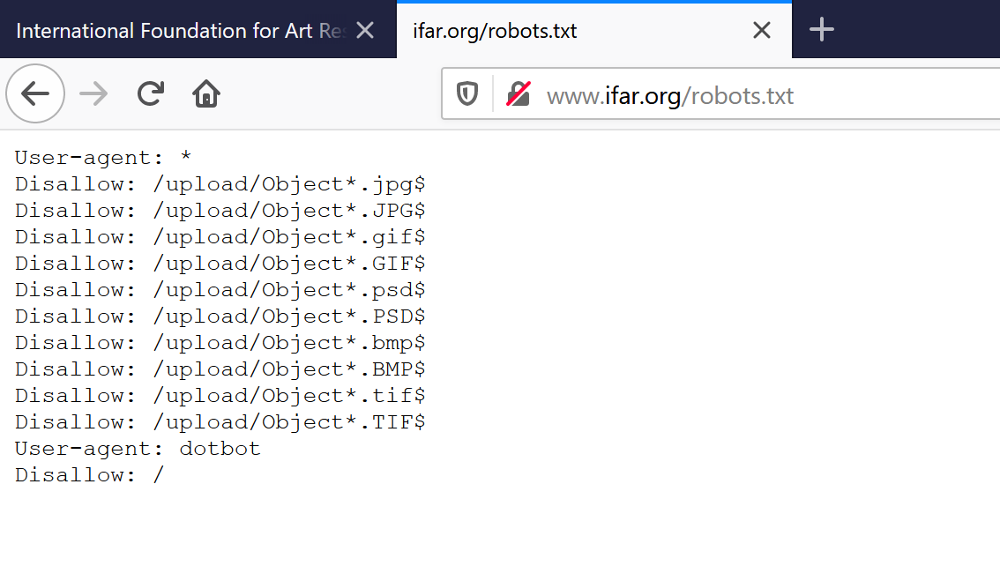
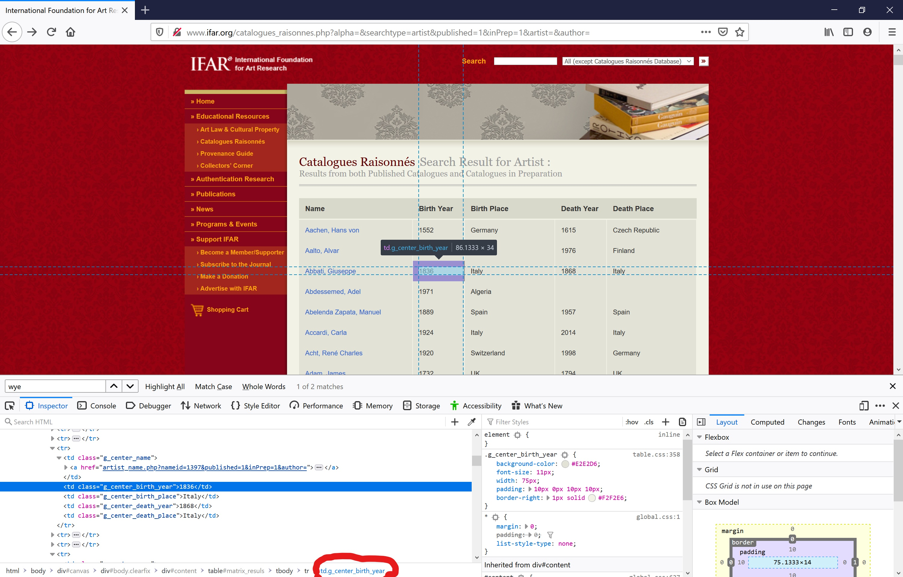
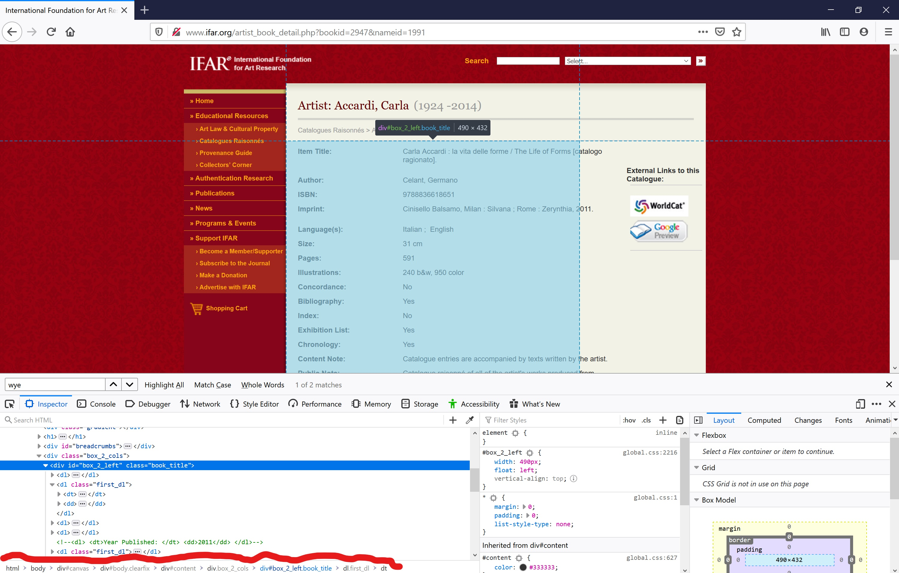

# Web Crawling the International Foundatiion for Art Research Website

_Last updated: **09 December 2019**_

Created by **Ramon Perez**

## *Outline*


This is a tutorial on how to crawl the International Foundation for Art Research website, a non-profit organisation providing up-to-date information on art objects and their creators. Althought this example is specific to this site, the code can be leveraged to crawl other sites where a three-part crawl is needed. That is, when crawling a website where there is a main webpage, a sub-link, and a sub-sub-link to follow for extracting information from recursively.

For this tutorial, we will be using Python version 3.7.3 and [Scrapy](https://scrapy.org/) version 1.7.3 in JupyterLab since it provides a neat environment for working with jupyter notebooks, plain python, and the command line. The are other fantastic IDE's and tools out there for crawling such as Atom, and Spider, or [selenium](https://selenium-python.readthedocs.io/) and [Beautiful Soup](https://www.crummy.com/software/BeautifulSoup/bs4/doc/), respectively, that could be used for this task as well. If you decide to try one of these, please share your process with us.

1. **Introduction to Scrapy**
2. **Intro to our Crawler**
3. **Crawling Part 1**
4. **Crawling Part 2**
5. **Crawling Part 3**
6. **Crawling Part 4**


### 1. Introduction to Scrapy

Scrapy is an open source Python package used for extracting data from the web in a fast and concice way. Its powerful and yet simple sintax makes scrapy the perfect tool for extracting data from a large number of websites with a few lines of code.

For a better user experience, Scrapy is at its best when used in combination with the command line, although it works totally fine within jupyter notebooks alone.

To install scrapy using pip, open up the command line and go to the folder where the files for this project will live at and then type:

```shell
$  pip install scrapy
```

To install scrapy using Anaconda open up the anaconda prompt with administrator rights and then type:

```shell
$  conda install -c conda-forge scrapy
```

In the next sections we will explore every part of our crawler in detail and then show how to run it

### 2. Intro to our Crawler

The first thing we want to do before crawling any website is to determine whether there are any restrictions we should be aware of. To do this, we type the web address of the main site we will be scraping and then we add to it "/robots.txt". The content below comes from IFAR.org and as you can see, they have no restrictions on their site.

Please keep in mind though that this is not often the case with other websites.




To initiate a spider crawler open up JupyterLab and navigate to the folder you will be working from. Then do the same thing from the command line.


Next, we can use the following command from the terminal to initialize our spider:

```shell
$  scrapy genspider aaspider "http://www.ifar.org/catalogues_raisonnes.php?alpha=&searchtype=artist&published=1&inPrep=1&artist=&author="
```


The "aa" stands art and artist, and the spider is for what we will be creating. You should now have in your folder an aaspider.py file with a blank canvas for you to start working on your spider.

### 3. **Crawling Part 1**

Open up aaspider.py and let's get started building our spider. As soon as you open the file you should see the following code.

```python
# -*- coding: utf-8 -*-
import scrapy


class AaspiderSpider(scrapy.Spider):
    name = 'aaspider'
    allowed_domains = ['http://www.ifar.org/catalogues_raisonnes.php?alpha=&searchtype=artist&published=1&inPrep=1&artist=&author=']
    start_urls = ['http://http://www.ifar.org/catalogues_raisonnes.php?alpha=&searchtype=artist&published=1&inPrep=1&artist=&author=/']

    def parse(self, response):
        pass

```

Immediately after you create the spider, scrapy generates a class (or collection of variables, functions, and commands) that leverages the functionalities of scrapy plus whichever new methods for scraping we create.

The first two lines have the encoding used by scrapy and the import command for the package we are using.

```python
# -*- coding: utf-8 -*-
import scrapy
```

Next we have the class which inherits all functionalities from spider class, our AaspiderSpider class. Classes are usually created using capital letters for each word, no spaces, and often, no underscores.

Inside the class we have the name we gave to our spider and the the allowed_domains variable, which should be changed to reflect the main website of IFAR (please see below) as it is the parent website with the information we need.

```python
class AaspiderSpider(scrapy.Spider):
    name = 'aaspider'
    allowed_domains = ['http://www.ifar.org']
    start_urls = ['http://http://www.ifar.org/catalogues_raisonnes.php?alpha=&searchtype=artist&published=1&inPrep=1&artist=&author=/']
```

The start_urls tells scrapy from where to start scraping data from. It is important to remember not to change this variables or create new ones with the same name because scrapy uses these specific variables in its methods to obtain the data we need.

Lastly, the function or method below is where we will write our code to crawl the first site.

```python
    def parse(self, response):
        pass
```

The argument **self** is used for self referencing inputs in the class, or for calling a specific functionality within the class. This can technically be called anything you want but it is common practice to use the word **self** so that data scientists and developers can iterate on each others code more efficiently.

The **response** argument helps us interact with the content obtained from the website. By passing methods to the response arguments is how we select and extract the information we need from a website. Since we have not written anything in our function yet, scrapy sets the body of our method parse as pass (another way of saying "do nothing here").


### 4. **Crawling Part 2**

The next step is to tell scrapy what to do once we initialize our spider. For that we need to provide our spider with three things in our first function:

1. What to scrape on the main website.
2. How to combine the links it finds and use them to go to the next website.
3. How to request and clean those new websites.

The first thing we need to do is to tell our spider what to get on the main website. For that we use the command yield (follow these instructions and give me information) to create a JSON file with the variables we need. See the code below.
```python
def parse(self, response):
        
        yield {
            'name': response.css('td.g_center_name > a::text').extract(),
            'link': response.css('td.g_center_name > a::attr(href)').extract(),
            'birth_year': response.css('.g_center_birth_year').extract(),
            'birth_place': response.css('.g_center_birth_place').extract(),
            'death_year': response.css('.g_center_death_year').extract(),
            'death_place': response.css('.g_center_death_place').extract()
        }
        
```
The first part of each line is the name of the variable we are presented with in IFAR, hence our variables of interest (see picture below). These are the keys of our JSON files or python dictionaries. To separate these keys from the values we use a __":"__.


Next we have the response argument which gets a response from the website and allows us to interact with its content. What follows the response argument is called a CSS selector, and these are the selectors the allow us to pick an choose any content available in the website (links, text, numbers, etc.).

We will not cover how CSS selectors work but it is extremely important to become familiar with them if one would like to become proficient at scraping data from the web. What the string inside the CSS selector is telling scrapy is, "find all the __td__ html tags with a class called __g_center_name__ and select the text ininside all of the __a__ tags that belong to the __g_center_name__ class."

To figure out which tags we need to focus on, we can go to any element in the website we want to scrape, right-click on it, and select inspect element to see the tags we should focus on. See picture below.



Once our method has finished obtaining the data we asked for, it will not go back to that yield method, instead, it will continue and do whatever else we ask it to do.

```python
def parse(self, response):
        
        yield {
            'name': response.css('td.g_center_name > a::text').extract(),
            'link': response.css('td.g_center_name > a::attr(href)').extract(),
            'birth_year': response.css('.g_center_birth_year').extract(),
            'birth_place': response.css('.g_center_birth_place').extract(),
            'death_year': response.css('.g_center_death_year').extract(),
            'death_place': response.css('.g_center_death_place').extract()
        }
        
        links_info = response.css('td.g_center_name > a::attr(href)')
        links = links_info.extract()
        href = []
        for url in links:
            href.append("http://www.ifar.org/" + url)

```

Since we know that links are not presented in full, we tell scrapy to get the sub links again and then assign them to a variable. We then loop over the variable, combine the links, and append them to a brand new list.

We then move on the last step of this method. Which is where we tell our spider to request the new links, and scrape the items we need until there are no more websites to follow.

```python
def parse(self, response):
        
        yield {
            'name': response.css('td.g_center_name > a::text').extract(),
            'link': response.css('td.g_center_name > a::attr(href)').extract(),
            'birth_year': response.css('.g_center_birth_year').extract(),
            'birth_place': response.css('.g_center_birth_place').extract(),
            'death_year': response.css('.g_center_death_year').extract(),
            'death_place': response.css('.g_center_death_place').extract()
        }
        
        links_info = response.css('td.g_center_name > a::attr(href)')
        links = links_info.extract()
        href = []
        for url in links:
            href.append("http://www.ifar.org/" + url)

        for i in href:
            yield scrapy.Request(i, callback=self.parse_details) 

```
Notice how in the last part of the code above how we tell our spider to yield a request for each link in href, and, using the callback option we also tell it to grab the code in a new method, which we have not created yet, and get some information from each link.

Let's explore the next step in the following section.

### 5. **Crawling Part 3**

The next step is to create a method that we will call, parse_details. We need this method to do three things for us:

1. Scrape the data for the links obtained in our first method.
2. Extract only the information we want plus the links to follow next.
3. Use those links in another request call to obtain the last set of websites.

Here is what the code for that would look like:

```python
 def parse_details(self, response):
        
        yield {
            'artist_one' : response.css('h1::text').extract_first(),
            'box_info' : response.css('div#box_2_left ::text').extract()
            }
        
        
        new_info = response.css('.catalogue_title > a::attr(href)')
        new_links = new_info.extract()
        href_new = []
        for url_new in new_links:
            href_new.append("http://www.ifar.org/" + url_new)

        for s in href_new:
            yield scrapy.Request(s, callback=self.parse_details_dos)
```

The anatomy of this new method is similar to the previous one, we need a yield call that gets two pieces of information from the second set of sites. These pieces of information are the artist and the text inside the box of information in each site.

If you notice that there are two distinct .extract() and .extract_first() methods, that is because the former takes all the information given a criterion while the latter takes only the first piece of information it finds.

We then extract the links of interest, attach the missing part with a for loop, and then use this new list for __get__ requests to these new sites while scraping the content in them. The code for scraping those websites will again be in a brand new method which we will call, parse_details_dos.

### 6. **Crawling Part 4**


Let's now define a new method only for the extraction of the information we need in the last set of websites.

```python
    def parse_details_dos(self, response):

        yield {
            'artist_two' : response.css('h1::text').extract_first(),
            'column_names' : response.css('.book_title > dl > dt::text').extract(),
            'content' : response.css('.book_title > dl').css('dd').extract()
        }

```

First determine the tags we need, then pass them to our CSS selectors, and let scrapy do the rest. To make it a bit easier on us, most browsers provide you with the CSS argument you will need for any given element on a website (see picture below). This saves us a lot of time that could be wasted going over html code trying to decipher what to use for each selector.



Finally, we should now have our complete spider that looks like the one below.

```python
import scrapy


class AaspiderSpider(scrapy.Spider):
    name = 'aaspider'
    allowed_domains = ['www.ifar.org']
    start_urls = [
                'http://www.ifar.org/catalogues_raisonnes.php?alpha=&searchtype=artist&published=1&inPrep=1&artist=&author='
                ]
    
    
    def parse(self, response):
        
        yield {
            'name': response.css('td.g_center_name > a::text').extract(),
            'link': response.css('td.g_center_name > a::attr(href)').extract(),
            'birth_year': response.css('.g_center_birth_year').extract(),
            'birth_place': response.css('.g_center_birth_place').extract(),
            'death_year': response.css('.g_center_death_year').extract(),
            'death_place': response.css('.g_center_death_place').extract()
        }
        
        links_info = response.css('td.g_center_name > a::attr(href)')
        links = links_info.extract()
        href = []
        for url in links:
            href.append("http://www.ifar.org/" + url)

        for i in href:
            yield scrapy.Request(i, callback=self.parse_details) 
            
    
    def parse_details(self, response):
        
        yield {
            'artist_one' : response.css('h1::text').extract_first(),
            'box_info' : response.css('div#box_2_left ::text').extract()
            }
        
        
        new_info = response.css('.catalogue_title > a::attr(href)')
        new_links = new_info.extract()
        href_new = []
        for url_new in new_links:
            href_new.append("http://www.ifar.org/" + url_new)

        for s in href_new:
            yield scrapy.Request(s, callback=self.parse_details_dos)
        
     
    def parse_details_dos(self, response):

        yield {
            'artist_two' : response.css('h1::text').extract_first(),
            'column_names' : response.css('.book_title > dl > dt::text').extract(),
            'content' : response.css('.book_title > dl').css('dd').extract()
        }

```

Your JupyterLab should look like the one in the following picture:


To run our spider use the following command in the terminal.

```shell
$ scrapy runspider aaspider.py -o data.json
```

The last part, ```-o data.json```, saves the output of our spider as data.json inside the folder we have selected.

**NOTE:** Please remember that at the time of writing, this spider will take a little bit less than 2 hour to scrape all the links in IFAR.

